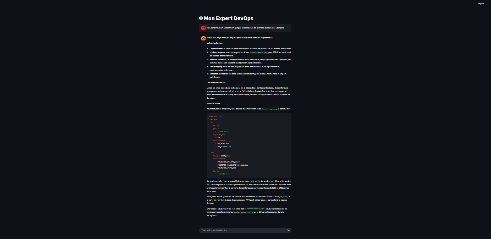

# 🤖 Expert DevOps IA - Stack Locale & Persistante

Ce projet est un assistant intelligent spécialisé dans l'ingénierie DevOps. Contrairement aux solutions Cloud, il offre une **confidentialité totale** et une **mémoire à long terme** grâce à une architecture locale optimisée pour les GPU NVIDIA.

---

## 📸 Aperçu de l'application

### 🖥️ Aperçu du fonctionnement


---

## 🏗️ Architecture du Système

Le projet repose sur une orchestration de micro-services conteneurisés permettant une séparation nette des responsabilités :

| Service | Technologie | Rôle |
| :--- | :--- | :--- |
| **Frontend** | Streamlit | Interface chat intuitive, fluide et réactive. |
| **Backend** | FastAPI | Orchestration, gestion du streaming et logique métier. |
| **LLM Engine** | Ollama | Hébergement du modèle **Llama 3** avec support GPU (CUDA). |
| **Database** | Redis | Stockage persistant de l'historique des conversations. |
| **DB UI** | RedisInsight | Interface visuelle pour explorer la mémoire de l'IA. |
| **Monitoring** | Glances | Dashboard de surveillance des ressources (CPU/GPU/RAM). |

---

## 🌟 Fonctionnalités Clés

* **🧠 Mémoire Persistante** : Grâce à Redis, l'IA conserve le contexte de vos échanges même après un redémarrage des conteneurs.
* **⚡ Inférence GPU Accélérée** : Optimisé pour les cartes NVIDIA (testé sur RTX 3050) pour une génération de texte quasi instantanée.
* **🔄 Hot Reload (Dev Mode)** : Développement fluide grâce aux volumes Docker. Modifiez le code dans `app/`, l'application se met à jour sans `rebuild`.
* **🔒 100% Hors-Ligne** : Aucune donnée ne quitte votre machine. Idéal pour manipuler des fichiers de configuration sensibles.

---

## 🛠️ Stack Technique

* **Langages** : Python 3.10+
* **Frameworks** : FastAPI, Streamlit
* **Base de données** : Redis Stack
* **Infrastructure** : Docker Compose
* **Modèle LLM** : Llama 3 (via Ollama)
* **Accélération** : NVIDIA Container Toolkit (CUDA)

---

## 🚀 Installation et Démarrage

### 1. Prérequis
* Docker et Docker Compose installés.
* Drivers NVIDIA et **NVIDIA Container Toolkit** configurés.

### 2. Lancement de la Stack
```bash
# Clonez le dépôt
git clone [https://github.com/votre-utilisateur/votre-projet.git](https://github.com/votre-utilisateur/votre-projet.git)
cd votre-projet

# Lancer les services (le premier lancement build les images)
sudo docker compose up -d